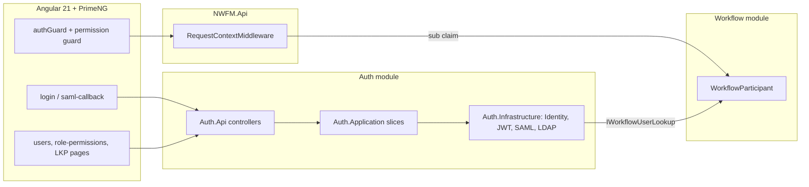

# Port the Auth & Authorization module into NWFM

## What is being moved

From [refernceApp](refernceApp) (NWC FSMS: VSA, ASP.NET Identity on `dbo`/`SM_*`, Angular 20 + PrimeNG + Transloco + NSwag) into NWFM (module-per-feature, schema-per-module, Angular 21 + Tailwind + ngx-translate + ng-openapi-gen). Nothing in the reference is modified; it is read-only source material.

Confirmed decisions: ASP.NET Core Identity remapped into an `Auth` schema; SSO + LDAP (for teams) + field-team OTP + API keys all included; PrimeNG 21 installed but i18n stays on ngx-translate; a new minimal `Auth.Teams` crew register; JWT identity replaces the participant selector; `ISmsSender` ported with both the NWC SOAP sender and a logging sender.

---

## Backend

### New module: `backend/src/Modules/Auth/`

Mirrors the existing Workflow module layout ([Workflow.Application](backend/src/Modules/Workflow/Workflow.Application), [Workflow.Infrastructure](backend/src/Modules/Workflow/Workflow.Infrastructure)) exactly — four projects added to [NWFM.sln](backend/NWFM.sln):

- `Auth.Domain` — entities, enums, constants. References `NWFM.Shared`.
- `Auth.Application` — `Commands/`, `Queries/`, `DTOs/`, `Constants/AuthErrors.cs`, `AssemblyMarker.cs`. Slice folders named `{Verb}{Entity}` with `{Name}Command.cs` / `{Name}CommandHandler.cs` / `{Name}CommandValidator.cs`, matching `RegisterParticipant`.
- `Auth.Infrastructure` — `AuthDbContext`, `Persistence/Configurations/`, `Persistence/Migrations/`, `Identity/`, `Authorization/`, `Services/`, `DependencyInjection.cs`.
- `Auth.Api` — thin controllers dispatching via `ISender`, loaded with `AddApplicationPart`.

Every handler returns `NWFM.Shared.Results.Result<T>` / `Result<PaginatedResult<T>>` — not the reference's `Result<T>`.

### Database: `Auth` schema

`AuthDbContext : IdentityDbContext<ApplicationUser, ApplicationRole, Guid>` with `modelBuilder.HasDefaultSchema("Auth")`, `ApplyConfigurationsFromAssembly`, and a design-time factory — same shape as [WorkflowDbContext](backend/src/Modules/Workflow/Workflow.Infrastructure/Persistence/WorkflowDbContext.cs).

Identity uses a **Guid key** (not the reference's string key) so `ApplicationUser.Id` maps directly onto `WorkflowParticipant.UserId` with no parsing. Table remap:

- `AspNetUsers` → `Auth.Users` (adds `TeamId`, `EmployeeNumber`, `DisplayNameAr`)
- `AspNetRoles` / `AspNetUserRoles` / `AspNetUserClaims` / `AspNetRoleClaims` / `AspNetUserLogins` / `AspNetUserTokens` → `Auth.Roles` / `Auth.UserRoles` / `Auth.UserClaims` / `Auth.RoleClaims` / `Auth.UserLogins` / `Auth.UserTokens`
- `SM_PERMISSION` → `Auth.Permissions`
- `SM_ROLE_PERMISSION` → `Auth.RolePermissions`
- `SM_USER_REFRESH_TOKEN` → `Auth.RefreshTokens`
- `SM_SSO_AUTH_CODE` → `Auth.SsoAuthorizationCodes`
- `ORG_SCOPES` → `Auth.OrgScopes`
- `TEAMS` → `Auth.Teams` (minimal: `Id`, `Name`, `Mobile`, `IsActive` + `DeviceName`/`DeviceUuid`/`AppVersion`/`DeviceOs`/`LastActiveLatitude`/`LastActiveLongitude`/`LastActiveAt`; the reference's `TeamType`, `ContractorId`, `Departments` are dropped)
- Org geography lookups keep their `LKP_` names inside the schema: `Auth.LKP_DEPARTMENT`, `Auth.LKP_CLUSTER`, `Auth.LKP_CBU`, `Auth.LKP_BRANCH`, `Auth.LKP_OPERATION_AREA`

Entities follow NWFM's light-DDD style: private parameterless constructor, private setters, static `Create` factories throwing `DomainException`. [OrgScope.cs](refernceApp/src/modules/Domain/Entities/Fsms/Org/OrgScope.cs) already fits and ports nearly verbatim.

**Migrations are not generated by me** — I will tell you when the model is ready so you can run `dotnet ef migrations add AddAuthModule --project src/Modules/Auth/Auth.Infrastructure --startup-project src/NWFM.Api`.

### Additions to `NWFM.Shared`

- `Caching/ICacheService.cs` + a `HybridCache` implementation and `CacheKeys` constants (no inline key strings). Required by the OTP challenge store and the permission resolver, which have no equivalent in NWFM today.
- `Behaviors/AuthorizationBehavior.cs` + `Security/AuthorizeAttribute.cs`, registered in the MediatR pipeline **before** `ValidationBehavior`.
- `Abstractions/ICurrentUser.cs` exposing `Id`, `UserName`, `Roles`, `Permissions`, `TeamId`.
- `Integration/Workflow/IWorkflowParticipantProvisioner.cs` — the reverse of the existing [IWorkflowUserLookup](backend/src/NWFM.Shared/Integration/Workflow/IWorkflowUserLookup.cs), implemented in `Workflow.Infrastructure` and called by Auth's `CreateUser` handler so every new user gets a matching `WorkflowParticipant`.

### Slices to port into `Auth.Application`

- Auth: `LoginUser`, `RefreshAccessToken`, `Logout`, `SsoSignIn`, `ExchangeSsoCode`, `LoginTeam`, `VerifyTeamOtp`, `ResendTeamOtp`, `GetCurrentUserProfile`, `GetSsoStatus`
- Permissions: `GetPermissions`, `GetRoles`, `GetRolePermissions`, `AssignRolePermissions`
- Users: `GetUsers` (paged), `GetUserById`, `CreateUser`, `UpdateUser`, `SetUserStatus`, `ResetUserPassword`
- Org scope: `IOrgScopeService`, `OrgScopeSet`, `OrgScopeQueryFilter`, `OrgHierarchyCache`, `OrgUnitMatcher`
- Lookups: paged list + create/update/deactivate for the five org-geography lookups only. The reference's FA types, task types, customer types, contractors, return reasons, C2M mappings and field catalog are survey-specific and excluded.

### `Auth.Infrastructure`

Ported from the reference: `AuthService`, `JwtTokenGenerator`, `UserAccountService`, `IdentityService`, `RoleLookup`, `ApplicationUserClaimsPrincipalFactory`, `PermissionResolver`, `PermissionPolicyProvider`, `PermissionAuthorizationHandler`, `PermissionRequirement`, `AnyPermissionRequirement`, `SsoAuthenticationSetup` (Sustainsys.Saml2), `LdapActiveDirectoryAuthenticator`, plus `NwcMessageSmsSender` and a new `LoggingSmsSender` selected by config.

### Policy and role catalog — needs your review during implementation

The reference's `FsmsPolicies` are survey permissions and do not transfer. I will define `NwfmPolicies` from NWFM's actual 20 nav entries, proposing: `ViewWorkflows`, `StartWorkflows`, `ClaimTasks`, `ManageDefinitions`, `ManageBindings`, `ManageCalendars`, `ManageSlaPolicies`, `ViewInstances`, `ManageIncidents`, `ManageDeadLetters`, `ManageParticipants`, `ManageGroups`, `ViewWorkload`, `ManageLookups`, `ManageUsers`, `ManageRolePermissions`. Roles: `Administrator`, `WorkflowAdmin`, `Supervisor`, `Participant`, `FieldTeam`, `Monitor`. Each of the 18 Workflow controllers then gets `[Authorize(Policy = ...)]`, and `DatabaseInitializer` seeds roles, permissions, the role-permission matrix, and one administrator account.

### Wiring in `NWFM.Api`

In [Program.cs](backend/src/NWFM.Api/Program.cs): register `AddAuthInfrastructure(...)`, MediatR/validators from `Auth.Application.AssemblyMarker`, `AuthorizationBehavior`, the Auth application part, CORS from a new `CorsOrigins` key, Swagger Bearer + ApiKey security definitions, and `app.UseAuthentication()` / `app.UseAuthorization()` before `MapControllers`.

[RequestContextMiddleware.cs](backend/src/NWFM.Api/Services/RequestContextMiddleware.cs) is rewritten: `ActorId` comes from the JWT `sub` claim and the participant is resolved by `UserId`; the `X-Workflow-Participant-Id` header and `DefaultActorId` fallback are removed. `ApplicationOptions.DefaultActorId` and its `ValidateOnStart` check go with them. `TenantScopeFilter` is unchanged.

`/api/app-context` stops returning the participant list and returns tenant plus the caller's profile.

### appsettings

Added to [appsettings.json](backend/src/NWFM.Api/appsettings.json), with a new `appsettings.Development.json` for local overrides: `JwtSettings`, `Sso`, `ActiveDirectory`, `TeamOtp`, `ExternalConsumers`, `ApiSecurity`, `CacheSettings`, `IntegrationSettings:NwcMessageService`, `CorsOrigins`. The signing key is a placeholder in the file and set via user secrets or environment variables — no real secret is committed.

### Backend packages (per-csproj; NWFM does not use central package management)

- `Auth.Infrastructure`: `Microsoft.AspNetCore.Identity.EntityFrameworkCore` 10.0.7, `Microsoft.AspNetCore.Authentication.JwtBearer` 10.0.7, `Microsoft.EntityFrameworkCore.SqlServer` 10.0.7, `System.DirectoryServices.Protocols` 10.0.7, `Sustainsys.Saml2.AspNetCore2` 2.11.0, `System.Security.Cryptography.Xml`
- `NWFM.Shared`: `Microsoft.Extensions.Caching.Hybrid` 10.0.0
- `Auth.Application`: `FluentValidation` 12.1.1, `MediatR` 12.4.1, `Mapster` 7.4.0

---

## Frontend

### Packages to install

`primeng@21.1.10`, `@primeng/themes@^21.0.4`, `@angular/cdk@^21` (a PrimeNG 21 peer, currently absent), `primeicons@^8`, `tailwindcss-primeui@^0.6.1`. PrimeNG is configured with `providePrimeNG` in [app.config.ts](frontend/src/app/app.config.ts) and its preset wired into [tailwind.config.js](frontend/tailwind.config.js).

Transloco is **not** installed — the ported pages' `t()` calls are converted to ngx-translate and their keys merged into the existing `public/assets/i18n/en.json` and `ar.json`.

Instead of `ngx-permissions` (RxJS-era, and NWFM is signal-first), I will write a small signal-based `permissionGuard` plus a `*hasPermission` structural directive in `core/auth` — roughly 60 lines covering everything the reference uses.

### New files

- `core/auth/` — `auth.service.ts`, `auth.store.ts` (signals + localStorage session), `auth.model.ts`, `sso.service.ts`, `permissions.ts`
- `core/guards/auth.guard.ts` — `authGuard`, `guestGuard`, `permissionGuard`
- `core/interceptors/` — `auth.interceptor.ts` (Bearer header) and `error.interceptor.ts` (401 → queued silent refresh → retry, or clear session and redirect to `/login`)
- `features/auth/` — `login`, `saml-callback`, `access-denied`
- `features/admin/users/` — list with server-side pagination, `user-form-dialog` (roles + org scopes), `user-reset-password-dialog`
- `features/admin/role-permissions/` — role × permission matrix
- `features/lookups/` — tabbed LKP management for departments, clusters, CBUs, branches, operation areas
- `shared/components/org-scope/` — `org-scope-selector` (cascading Cluster → CBU → Branch/Operation Area) and `org-filter-dialog`

Per the frontend rules: every PrimeNG overlay inside a dialog gets `appendTo="body"`, paginated tables inside dialogs get `paginatorDropdownAppendTo="body"`, all API calls show a loading state cleared in `finalize`, and submit buttons use `[loading]` + `[disabled]` for the request duration.

### Changes to existing files

- [app.routes.ts](frontend/src/app/app.routes.ts) — add `/login`, `/auth/saml-callback`, `/auth/access-denied`; wrap all existing routes in `canActivate: [authGuard]` and add `permissionGuard` with a permission code per route.
- [app.component.ts](frontend/src/app/app.component.ts) / `.html` — remove the participant `<select>`; add the signed-in user chip with a logout menu; filter the `links[]` nav array by permission.
- [app.config.ts](frontend/src/app/app.config.ts) — register both interceptors, `providePrimeNG`, and change the app initializer to restore the session instead of loading participants.
- `core/context/app-context.service.ts` and `context.interceptor.ts` — the `X-Workflow-Participant-Id` header and participant selection are removed; tenant handling stays.

### API client

After the backend compiles and runs, regenerate with `npm run generate:api` (ng-openapi-gen against `http://localhost:5080/swagger/v1/swagger.json`) before writing any client code against the new types. The generated output in `src/app/shared/models/` is never hand-edited.

---

## Verification

- `dotnet build backend/NWFM.sln` and `dotnet test backend/NWFM.sln` (existing 217 tests must still pass after the actor-context change), plus new xUnit tests for the JWT generator, permission resolver, OTP challenge lifecycle, and org-scope filtering.
- `npm run build:prod` and `npm test -- --watch=false --browsers=ChromeHeadless` in `frontend`.
- Manual: log in as the seeded administrator, create a user with roles and an org scope, confirm the nav hides unpermitted entries, confirm a 401 triggers a silent refresh, and confirm a workflow task is attributed to the logged-in user rather than a selected participant.
- `scripts/smoke-test.mjs` needs updating — it currently asserts the participant-header behaviour that this change removes.

## Open item

The NWFM permission and role catalog above is my proposal derived from the existing navigation. I will confirm it with you before seeding it, since it determines what every role can reach.
</plan>
<todos>[{"id": "shared", "content": "Add ICacheService/HybridCache, AuthorizationBehavior, AuthorizeAttribute, ICurrentUser, and IWorkflowParticipantProvisioner to NWFM.Shared"}, {"id": "projects", "content": "Create Auth.Domain/Application/Infrastructure/Api projects, add to NWFM.sln, and add the NuGet packages"}, {"id": "domain", "content": "Port auth domain entities (Permission, RolePermission, RefreshToken, SsoAuthorizationCode, OrgScope, Team, five LKP lookups) in NWFM light-DDD style"}, {"id": "dbcontext", "content": "Build AuthDbContext with Guid-keyed Identity, Auth schema, EF configurations, and design-time factory"}, {"id": "slices", "content": "Port Auth.Application slices: login, refresh, logout, SSO sign-in/exchange, team login + OTP, profile, permissions, users, org scope, lookups"}, {"id": "infra", "content": "Port Auth.Infrastructure: AuthService, JwtTokenGenerator, permission resolver/policy provider/handler, SAML setup, LDAP authenticator, SMS senders"}, {"id": "policies", "content": "Define NwfmPolicies and the role catalog, confirm with the user, and seed roles/permissions/matrix/administrator in DatabaseInitializer"}, {"id": "wiring", "content": "Wire Program.cs (authentication, authorization, CORS, Swagger security), rewrite RequestContextMiddleware to use the JWT subject, and update /api/app-context"}, {"id": "gate", "content": "Apply [Authorize(Policy = ...)] across the 18 Workflow controllers"}, {"id": "settings", "content": "Add JwtSettings, Sso, ActiveDirectory, TeamOtp, ExternalConsumers, ApiSecurity, CacheSettings, CorsOrigins to appsettings and a Development override"}, {"id": "migration", "content": "Notify the user that the AddAuthModule EF migration needs to be generated manually, then verify the database update"}, {"id": "fe-packages", "content": "Install PrimeNG 21, @angular/cdk, @primeng/themes, primeicons, tailwindcss-primeui and configure providePrimeNG plus the Tailwind preset"}, {"id": "fe-core", "content": "Build core/auth (service, store, SSO), guards, permission directive, and the auth/error interceptors"}, {"id": "fe-pages", "content": "Build login, saml-callback, access-denied, users, role-permissions, LKP, and org-scope selector pages with PrimeNG"}, {"id": "fe-shell", "content": "Remove the participant selector, add the user chip and logout, filter nav by permission, and guard all existing routes"}, {"id": "fe-i18n", "content": "Merge auth, users, role-permission, org-scope, and lookup keys into en.json and ar.json"}, {"id": "client", "content": "Regenerate the ng-openapi-gen client against the running API"}, {"id": "verify", "content": "Build and test both apps, add new backend tests, and update scripts/smoke-test.mjs for the removed participant header"}]</todos>
