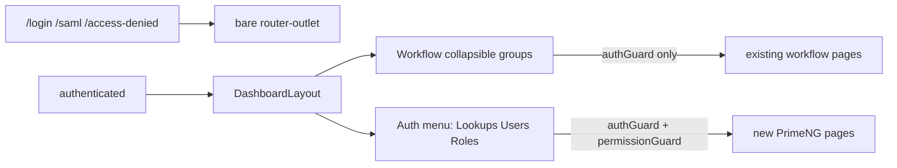

# Auth layout, login, and LKP pages

## What stays untouched

- No edits to workflow feature components under [`frontend/src/app/features/workflow`](frontend/src/app/features/workflow) or [`frontend/src/app/features/admin`](frontend/src/app/features/admin) (except adding **new** auth-admin feature folders).
- Workflow routes keep only the existing `authGuard` (must be logged in). **No** `permissionGuard` and **no** `*hasPermission` inside workflow templates.
- No `ng-openapi-gen` run. New pages call Auth APIs with dedicated `HttpClient` services, same pattern as [`frontend/src/app/core/auth/auth.service.ts`](frontend/src/app/core/auth/auth.service.ts).

## Why the red banner appears today

[`/api/app-context`](backend/src/NWFM.Api/Program.cs) now returns `{ tenantId }`, while [`AppContextService.load()`](frontend/src/app/core/context/app-context.service.ts) still expects `{ tenant, participants, defaultParticipantId }` and then throws. The shell in [`app.component.html`](frontend/src/app/app.component.html) hides `<router-outlet>` whenever `context.error()` is set.

Fix in the service only: map `{ tenantId }` to `{ tenant: { id, name: 'NWFM' }, participants: [], defaultParticipantId: '' }` so `tenant()` still works for workflow callers. Do not overlay the whole app on a context error.

## 1. Full site layout from the reference app (chrome + colors)

Take the **entire authenticated chrome** from the reference app — not a restyle of the current Tailwind header/sidebar. Workflow pages are not rewritten; they keep using Tailwind/`wf-*`/`prv-*` **inside** `<router-outlet>`. Those utilities do not depend on the current NWFM header markup, so swapping chrome is compatible.

Replace the inline shell in [`app.component.html`](frontend/src/app/app.component.html) with a port of [`dashboard-layout`](refernceApp/src/WebApps/NWC.Web/src/app/layout/dashboard-layout) **including its SCSS and tokens**.

New / updated files:
- `frontend/src/app/layout/dashboard-layout/dashboard-layout.component.ts|html|scss` — copy structure and coloring from the reference (grid sidebar+main, collapsible rail, topbar, user chip, theme + language toggles, logout).
- `frontend/src/app/core/theme/water-preset.ts` — port the reference Deep Water PrimeNG preset (`#157591` primary ramp).
- `frontend/src/app/core/theme/theme.service.ts` — light/dark `data-theme` toggle, same as the reference.
- [`app.config.ts`](frontend/src/app/app.config.ts) — `providePrimeNG({ theme: { preset: WaterPreset } })` instead of stock Aura.
- [`frontend/src/styles.css`](frontend/src/styles.css) (or a new `_app-tokens.css`) — port `:root` / `[data-theme='dark']` tokens from the reference [`styles.scss`](refernceApp/src/WebApps/NWC.Web/src/styles.scss): `--water-*`, `--app-ground`, `--app-surface`, `--app-border`, `--app-shadow-*`, `--acc-*`.

Keep [`AppComponent`](frontend/src/app/app.component.ts) as a thin host: authenticated → this layout; guest → bare `<router-outlet>` (login/SSO/access-denied stay full-screen).

Content pane: `.main` / `.content` uses `--app-ground` and scrolls; `<router-outlet>` is unchanged. Workflow pages continue to paint their own cards/tables with existing classes.

Topbar heading: set `titleKey` / `subtitleKey` on **new Auth routes only**. Do not strip `WorkflowPageHeaderComponent` from workflow pages (that would be editing them). If both would show, leave the topbar title empty on workflow URLs so we do not duplicate H1s.

Do **not** restyle or rewrite `wf-*` / `prv-*` / workflow templates. A global primary-token change may slightly tint shared focus/links; that is acceptable and is not a workflow-page edit.

### Sidebar groups

Workflow items are the **current** [`links` array](frontend/src/app/app.component.ts) regrouped. **No `permissions` field** on these items — always visible after login.

- **Operations:** Overview, Start workflow, Tasks, Requests, Workload, Notifications, Help
- **Organization:** Participants, Assignment groups, Departments
- **Administration:** Designer and definitions, Bindings, Execution monitor, Incidents, Message recovery, Business calendars, SLA policies, Actions catalog, Workflow catalog

Auth section (own block, permission-filtered with existing [`HasPermissionDirective`](frontend/src/app/core/auth/permissions.ts), Administrator bypass already in the directive):

- Lookups → `/lookups` (`ManageLookups`)
- Users → `/admin/users` (`ManageUsers`)
- Role permissions → `/admin/roles` (`CanManageRolePermissions`)

## 2. Login / SSO look like the reference

Replace the centered card in [`login.component.ts`](frontend/src/app/features/auth/login/login.component.ts) with the reference split layout (hero pane + form pane, droplets/waves, language toggle, SSO primary + administrator local login). Source: [`refernceApp/.../login.component.html|scss`](refernceApp/src/WebApps/NWC.Web/src/app/features/auth/login).

Adapt, don’t copy FSMS copy:

- ngx-translate instead of Transloco
- Hero bullets for workflow (tasks / requests / definitions) instead of sites/readings/reports
- Keep existing `AuthService` / `AuthStore` / SSO status + `local=1` fallback
- Bring SAML callback and access-denied closer to the reference (spinner handover, reason-based messages)

Tighten [`authGuard`](frontend/src/app/core/guards/auth.guard.ts) to preserve `returnUrl` like the reference. Apply `permissionGuard(...)` **only** on `/lookups`, `/admin/users`, `/admin/roles`.

## 3. Lookups page (5 LKP tabs, not 12)

Reference lookups are a 12-tab PrimeNG page. NWFM Auth only exposes five GET endpoints in [`LookupsController`](backend/src/Modules/Auth/Auth.Api/Controllers/LookupsController.cs): Departments, Clusters, CBUs, Branches, Operation Areas.

Port the **same tabbed table + search + dialog pattern** for those five only. Skip FSMS-only tabs (FA types, contractors, etc.).

Backend today is **read-only**. To make the LKP page actually match the reference (create / edit / toggle active):

- Add Auth.Application lookup commands (create/update/set-active) plus domain `Update` / `SetActive` on the five lookup entities
- Extend [`LookupsController`](backend/src/Modules/Auth/Auth.Api/Controllers/LookupsController.cs) with POST/PUT matching the GET routes
- Frontend `LookupsService` talks to `/api/v1/lookups/{departments|clusters|cbus|branches|operation-areas}`

Parent pickers: Cluster → CBU → Branch / Operation Area, using `ParentCode` already on [`LookupItemDto`](backend/src/Modules/Auth/Auth.Application/Lookups/Queries/GetLookupsQuery.cs).

## 4. Users and role-permissions pages

Backend is already there ([`UsersController`](backend/src/Modules/Auth/Auth.Api/Controllers/UsersController.cs), [`AdminController`](backend/src/Modules/Auth/Auth.Api/Controllers/AdminController.cs)). Port the reference PrimeNG pages:

- `features/admin/users` — lazy table, search/status filter, create/edit dialog, enable/disable, reset password
- `features/admin/role-permissions` — permission matrix by module, per-role save

Skip a standalone org-scope page (the reference has none). Skip embedding `OrgScopeSelector` on the user form until Auth exposes org-scope write APIs (not in scope here).

Content protection: hide create/edit/save actions with `*hasPermission` on these two pages only.

## 5. i18n

Add keys to [`en.json`](frontend/public/assets/i18n/en.json) / [`ar.json`](frontend/public/assets/i18n/ar.json) under `nav.*`, `auth.*` (hero/SSO/reasons), `lookups.*`, `users.*`, `admin.rolePermissions.*`. Keep existing workflow keys unchanged.

## Out of scope

- Regenerating `src/app/shared/models`
- Permission-gating workflow routes or buttons
- Porting Teams, Reports, Data Migration, or the extra FSMS lookup tabs
- Rewriting workflow page templates or `wf-*` / `prv-*` component internals (they keep working inside the new content pane)
