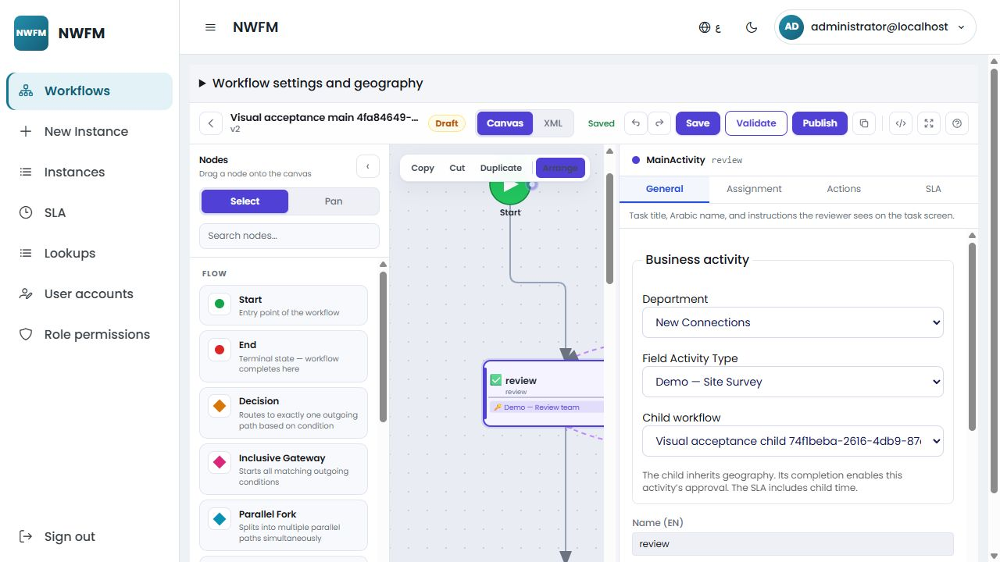
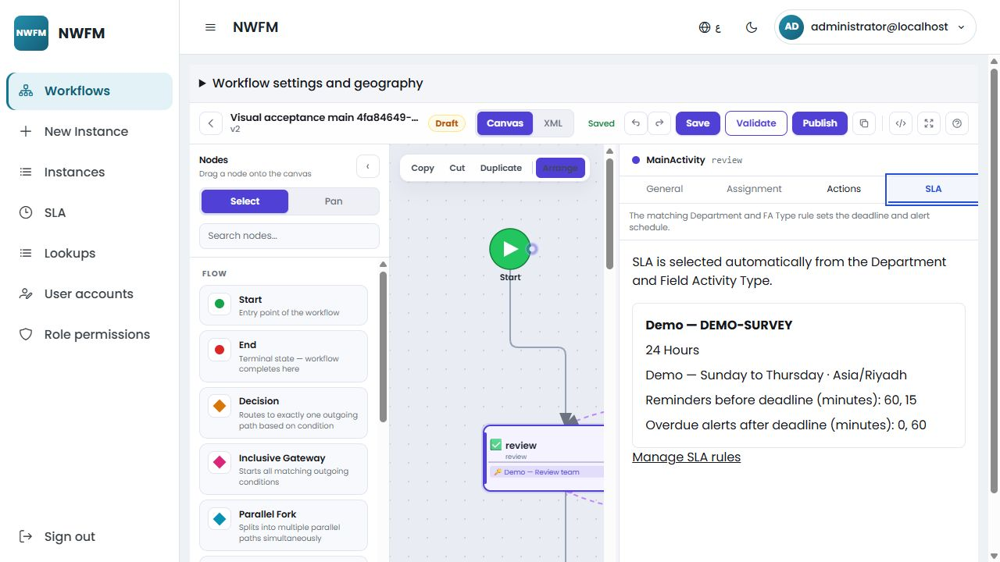
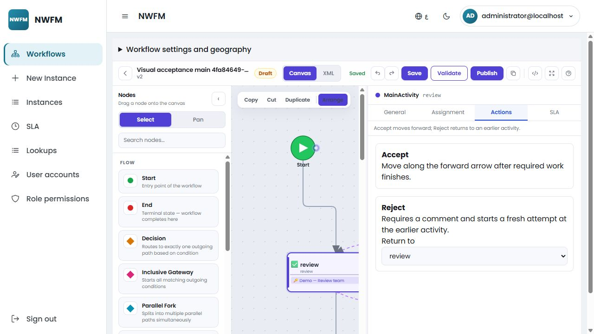
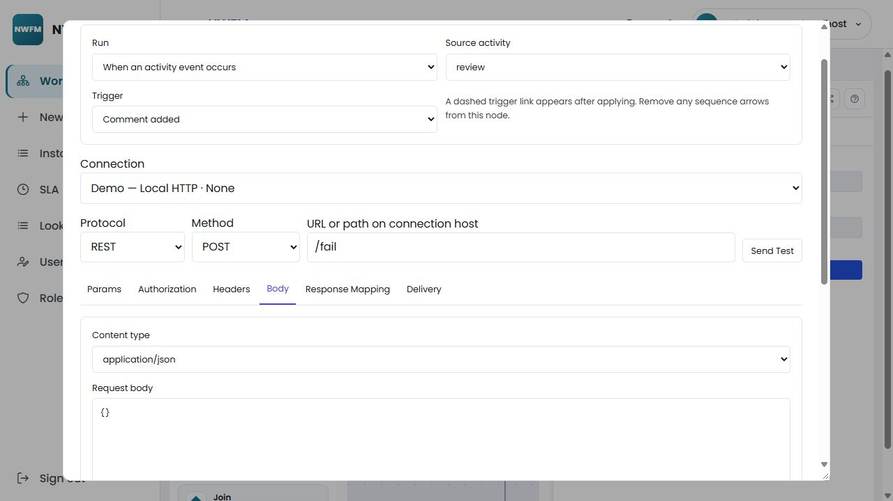
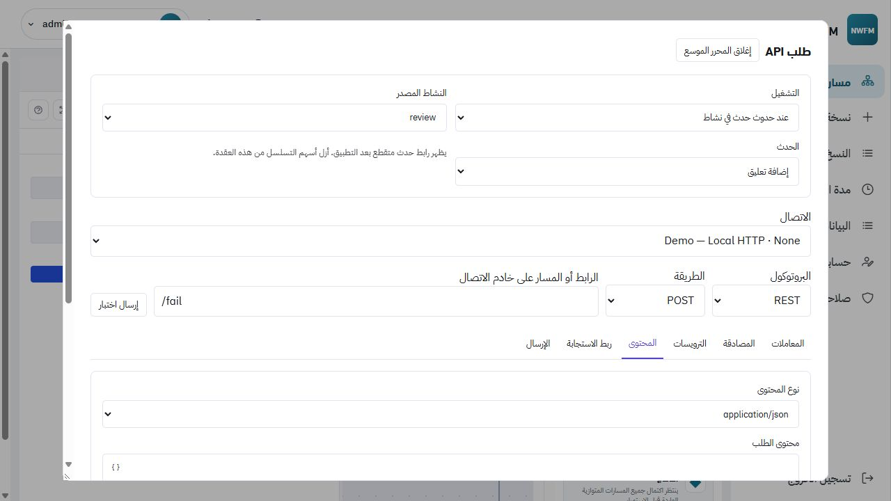

# Workflow actions, automatic SLA and visual event nodes

This revision runs on `workflow-improvement` and builds on the authenticated workspace in [WORKFLOW_WORKSPACE.md](WORKFLOW_WORKSPACE.md). Workflow navigation now contains Workflows, New Instance, Instances, SLA and Lookups. Auth administration keeps its existing permissions.

## Designer and execution

Business activities have General, Assignment, Actions and SLA tabs. Accept retains the internal `APPROVE` key and follows the normal forward connection. Reject requires a comment and enters an earlier activity as a new execution. Only the first business activity may return to itself. Returning to a Main Activity reruns its pinned child. Add Comment remains a separate operation and never advances the instance.

Publication validates rejection destinations using sequence reachability. Trigger links and rejection links are not sequence transitions. Main approval remains gated by successful child completion, including direct API requests.

API Request, Email and SMS nodes support either sequence execution or an activity trigger. Trigger nodes have one source/trigger binding, displayed as a labelled dashed link, and cannot have sequence connections. Multiple nodes may subscribe to a trigger. Timer and authenticated Wait for Event remain separate nodes. Existing Call Activity and Set Variables nodes still load; they are omitted from the new-node palette.

Required entry, action and completion jobs gate progression. Required comment jobs leave the task open and prevent its completion until resolved. Failure/reminder/overdue jobs always run in the background. Background results cannot change workflow variables or a selected route. Jobs retain stable operation IDs across retries; individual comments have distinct occurrence IDs. Network delivery remains outside the transaction that records the action and queues its jobs.

The expanded request editor provides Params, Authorization, Headers, Body, Response Mapping and Delivery tabs, sample-variable tests, timing and response diagnostics. Connections own protected credentials. SOAP supports manual 1.1/1.2 envelopes, actions, namespaces, XPath mappings and Faults. SMS uses a configurable HTTP provider; email uses SMTP. Tests do not advance instances. WSDL import, WS-Security, arbitrary scripts and form-builder integration remain outside this phase.

## Automatic SLA rules and calendars

- One active tenant rule may match a Department + Field Activity Type pair. The server validates active department membership; a filtered unique index also enforces uniqueness.
- Designers can resolve a rule without receiving SLA management permission. Missing active rules block publication.
- Publication snapshots duration, timezone, working periods, holidays and reminder/overdue offsets into the activity projection. Subsequent rule/calendar edits affect subsequent publications only.
- Minutes, hours and days count elapsed time. Business hours count working periods and skip holidays. Business days count eligible calendar days while preserving the entry time of day. Reminder/overdue offsets are elapsed minutes relative to the calculated deadline.
- Main clocks start on entry, including child work and required final processing. Each child and each rework execution has its own clock.
- The worker persists the next alert and occurrence count under the workflow execution lock. Alerts use stable per-execution threshold keys, preventing duplicate jobs after retries/restarts. Alerts do not reassign work.

The SLA page maintains rules and calendar working periods/holidays. Calendar management requires `ManageCalendars`; rule management requires `ManageSlaPolicies`.

### API additions

All paths below begin `/api/workflow/workspace/sla` and retain tenant filtering.

| Method/path | Permission and purpose |
| --- | --- |
| `GET /` | `ManageSlaPolicies`: list tenant rules |
| `POST /`, `PUT /{id}` | `ManageSlaPolicies`: create, edit or deactivate a rule |
| `GET /resolve?departmentCode=50&fieldActivityCode=DEMO-SURVEY` | `ManageDefinitions`: preview the matching rule and calendar |
| `GET /calendars` | `ManageSlaPolicies`: active calendar choices |

Calendar period/holiday removal extends the existing authorized calendar API. Instance responses include resolved SLA information, completion blocking, event node IDs, source activity IDs, delivery attempts and redacted diagnostics. HTTP test responses include `elapsedMilliseconds`.

## Migration and compatibility

Apply the Auth/workspace migrations from the previous revision first, then Workflow `20260922095308_WorkflowVisualSla`. It adds nullable Department/FA and event-node fields, alert scheduling fields and the filtered SLA index. It does not rewrite published versions or running instances.

From the repository root:

```powershell
dotnet ef database update --project backend/src/Modules/Workflow/Workflow.Infrastructure --startup-project backend/src/NWFM.Api --context WorkflowDbContext
dotnet ef migrations has-pending-model-changes --project backend/src/Modules/Workflow/Workflow.Infrastructure --startup-project backend/src/NWFM.Api --context WorkflowDbContext
dotnet ef migrations script --idempotent --project backend/src/Modules/Workflow/Workflow.Infrastructure --startup-project backend/src/NWFM.Api --context WorkflowDbContext --output workflow-migrations.sql
```

Deploy backend/frontend together and preserve the Data Protection key ring. The current API applies Workflow migrations at startup; Auth startup flags remain separate. Keep demo seeding disabled for business deployments.

New/edited workspace drafts use `designerVersion: 2`. Supported embedded events convert to visible nodes with stable identifiers on draft save; converted events are removed from the embedded representation. Hidden form/data settings survive save/reload. Unsupported old actions require explicit adaptation before simplified publication. Legacy published versions retain their existing runtime path.

## Local demo setup

Use an explicitly disposable database. The normal development database is not needed for automated verification.

```powershell
# Terminal 1: local REST/SOAP/SMS and SMTP transports
node scripts/workflow-demo-transports.mjs

# Terminal 2: development API against a separate local demo database
$env:ConnectionStrings__DefaultConnection='Server=localhost;Database=NWFM_WorkflowDemo;Integrated Security=True;TrustServerCertificate=True'
$env:WorkflowDemo__Enabled='true'
$env:WorkflowSettings__AllowPrivateConnections='true'
$env:WorkflowDemo__CallbackKey='nwfm-local-demo-callback-key-testing-only'
dotnet run --project backend/src/NWFM.Api
```

Default transports use HTTP 5091 and SMTP 2525. Override with `DEMO_HTTP_PORT` / `DEMO_SMTP_PORT` and matching `WorkflowDemo:HttpAddress` / `WorkflowDemo:SmtpPort`. The seeded local development login remains `administrator@localhost` / `Administrator1!` when Auth development seeding is enabled.

The demo adds only missing FA/rule records for Water Network (Isolation, Request Review, Closure), Waste Water (Blockage Inspection, Sewer Cleaning), and New Connections (Site Survey, Connection Installation). New visual demo definition keys end in `-VISUAL`, preserving earlier demo publications. Local scenarios cover child execution, main approval, rework, completion, overdue SLA, required failure and callback waiting. The main demo includes both triggered notifications/API calls and an in-flow completion-record API node.

## Walkthrough

1. Open a draft, select a Main Activity or User Task, then choose **New Connections → Demo — Site Survey** in General. The SLA tab immediately shows its matching duration, calendar and alerts.
2. In Actions, retain Accept and choose the permitted Reject destination. Save, reload, validate and publish. Missing SLA or invalid backward routes produce publication errors.
3. In New Instance, start a published main demo. Open it in Instances and select the matching demo participant. Accept the child checklist before the main Accept button becomes available. Reject with a comment to see a new child attempt. Add Comment records history without movement.
4. Place an API Request between normal arrows for sequence execution. For a triggered API, choose **When an activity event occurs**, its source activity and trigger, then remove any sequence arrows. Apply to display the dashed link. Save/reload preserves both modes.
5. Expand the API editor, choose a local connection and provide sample variables in Delivery. Send Test displays status, elapsed time, headers/body and mapping results. Inspect SOAP, email, SMS and callback examples in the visual demos.
6. Open a failed instance operation, recover the local provider (`POST /recover`), and Retry delivery. Inspect required blocking and background completion in the history. Switch to Arabic to check the mirrored layout and keyboard tab navigation.







## Verification evidence — 22 September 2026

- Backend regression suite: **326 passed**. Release solution build passed.
- Frontend headless Chrome suite: **64 passed**. Production build passed.
- Fresh-database visual acceptance: **64 HTTP checks**, covering FA/rule matching, immutable SLA settings, invalid graphs, child gating, rework, required comments/retries, duplicate actions, REST/SOAP Faults and background SMS/email.
- Fresh-database workspace acceptance: **82 HTTP checks**, including authenticated actions, concurrent approval, suspension/cancellation, comments, seeded completion/failure recovery, callback deduplication, tenant and impersonation rejection. Polling affects check counts.
- New migration applied to disposable SQL Server databases; generated idempotent migration SQL reapplied successfully. EF reports no pending model changes.
- Seed rerun after a real API restart preserved workflow, instance, SLA and all three departments' FA identifiers without duplication. Existing published test versions remained operational across restarts.
- Browser checks covered New Connections cascading FA selection, automatic SLA preview, save/reload, fixed rejection destination, keyboard activity tabs, expanded API tests and English/Arabic layouts.

Build output retains existing package-reference/Auth warnings and the Angular initial bundle warning (~748 kB versus a 500 kB warning budget). Local transports verify behavior; live-provider credentials and production capacity testing remain deployment work.
